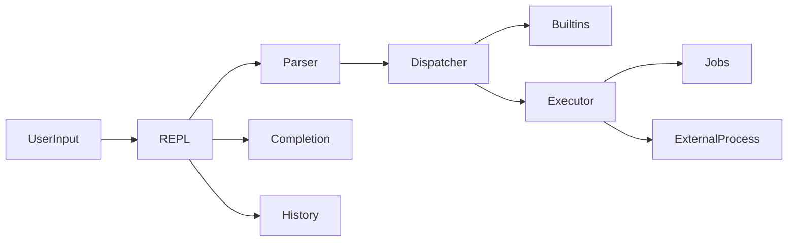
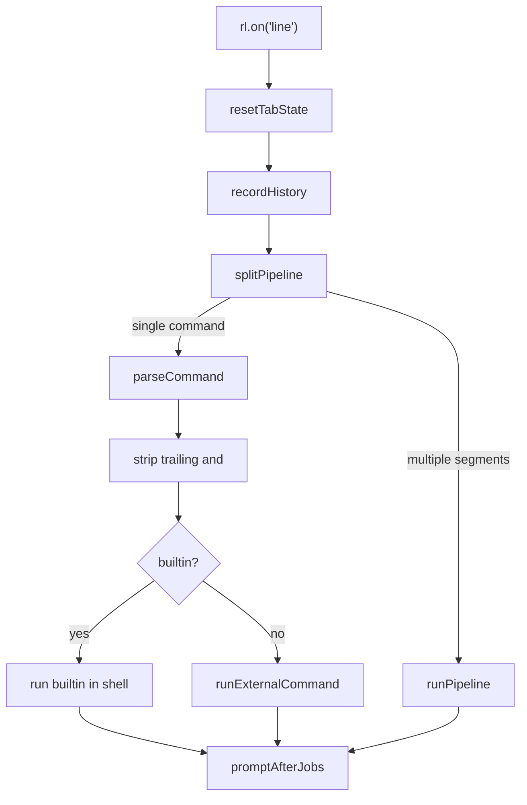

# Shell Project Guide — by Ehab Nada

A concept-first walkthrough of this [CodeCrafters “Build Your Own Shell”](https://app.codecrafters.io/courses/shell/overview) solution, built in **TypeScript** with **Bun**.

The short portfolio overview lives in [`README.md`](../README.md). This guide explains **what each idea means**, **what the stage required**, **where the code lives**, and **why it is designed that way**.

Run the shell locally with:

```sh
bun install
bun run app/main.ts
```

---

## Table of contents

1. [What a shell is](#1-what-a-shell-is)
2. [Architecture and modules](#2-architecture-and-modules)
   - [Imported Node.js/Bun APIs](#imported-nodejsbun-apis)
3. [Command lifecycle](#3-command-lifecycle)
4. [REPL](#4-repl)
5. [Builtins](#5-builtins)
6. [PATH and external commands](#6-path-and-external-commands)
7. [Parsing and quoting](#7-parsing-and-quoting)
8. [Redirects](#8-redirects)
9. [Navigation (`pwd`, `cd`, `~`)](#9-navigation-pwd-cd-)
10. [Tab completion](#10-tab-completion)
11. [Pipelines](#11-pipelines)
12. [Background jobs](#12-background-jobs)
13. [History](#13-history)
14. [Variables and expansion](#14-variables-and-expansion)
15. [Shared types and state](#15-shared-types-and-state)
16. [Design notes and limits](#16-design-notes-and-limits)
17. [Glossary](#17-glossary)
18. [Further reading](#18-further-reading)

---

## 1. What a shell is

A **shell** is a program that sits between you and the operating system. You type a command; the shell:

1. reads the line,
2. figures out what you meant (parse),
3. either runs a built-in action itself or starts another program,
4. shows output,
5. waits for the next line.

Your laptop already has shells like `bash`, `zsh`, or `fish`. This project is a smaller POSIX-style shell that implements the same core ideas step by step.

---

## 2. Architecture and modules



| File | Owns |
|------|------|
| [`app/main.ts`](../app/main.ts) | REPL entry, builtin dispatch, trailing `&` |
| [`app/parser.ts`](../app/parser.ts) | Quotes, redirects, pipes, `$VAR` expansion |
| [`app/executor.ts`](../app/executor.ts) | Spawn external commands, pipelines, background jobs |
| [`app/builtins.ts`](../app/builtins.ts) | `complete`, `history`, `declare`, pipeline builtin output |
| [`app/completion.ts`](../app/completion.ts) | Tab completion and programmable `complete -C` |
| [`app/jobs.ts`](../app/jobs.ts) | Job IDs, status lines, Done reaping |
| [`app/history.ts`](../app/history.ts) | In-memory history + file persistence |
| [`app/variables.ts`](../app/variables.ts) | Shell-local variables |
| [`app/runtime.ts`](../app/runtime.ts) | Shared readline handle + prompt helpers |
| [`app/io.ts`](../app/io.ts) | Writing builtin output / redirects to files |
| [`app/fsUtils.ts`](../app/fsUtils.ts) | PATH lookup, tilde, filesystem completion |
| [`app/state.ts`](../app/state.ts) | Shared registries (`jobTable`, builtins list, …) |
| [`app/types.ts`](../app/types.ts) | Shared types (`Job`, `Redirect`, `PathHit`) |

### Imported Node.js/Bun APIs

These are not TypeScript functions. They are Node.js-compatible runtime APIs
provided by Bun. TypeScript adds type checking around their use.

| Imported API | Module | Project location | Purpose |
|---|---|---|---|
| `createInterface` | `readline` | [`app/main.ts`](../app/main.ts) — REPL initialization | Creates terminal input, the prompt, and Tab completion |
| `spawn` | `child_process` | [`app/executor.ts`](../app/executor.ts) — `runExternalCommand()`, `runPipeline()` | Runs external commands and pipeline stages asynchronously |
| `spawnSync` | `child_process` | [`app/completion.ts`](../app/completion.ts) — `completeProgrammable()`; [`app/jobs.ts`](../app/jobs.ts) — `isProcessAlive()` | Runs completion helpers and `ps` synchronously |
| `accessSync` | `fs` | [`app/fsUtils.ts`](../app/fsUtils.ts) — `findExecutableCompletions()`, `findExecutableInPath()` | Checks executable permissions |
| `readdirSync` | `fs` | [`app/fsUtils.ts`](../app/fsUtils.ts) — `findPathHits()`, `findExecutableCompletions()` | Reads directory contents |
| `statSync` | `fs` | [`app/fsUtils.ts`](../app/fsUtils.ts) — `isDirectory()`, `findPathHits()` | Checks whether paths are directories |
| `readFileSync` | `fs` | [`app/history.ts`](../app/history.ts) — `loadHistoryFile()`; [`app/jobs.ts`](../app/jobs.ts) — `isProcessAlive()` | Reads history and Linux process files |
| `writeFileSync` | `fs` | [`app/history.ts`](../app/history.ts) — `writeHistoryFile()`; [`app/io.ts`](../app/io.ts) — `writeToRedirect()` | Overwrites history and redirected output files |
| `appendFileSync` | `fs` | [`app/history.ts`](../app/history.ts) — `appendHistoryFile()`; [`app/io.ts`](../app/io.ts) — `writeToRedirect()` | Appends history and redirected output |
| `openSync` | `fs` | [`app/executor.ts`](../app/executor.ts) — `stdioFromRedirects()` | Opens redirect files for child processes |
| `closeSync` | `fs` | [`app/executor.ts`](../app/executor.ts) — `closeRedirects()` | Closes redirect file descriptors |
| `constants.X_OK` | `fs` | [`app/fsUtils.ts`](../app/fsUtils.ts) — `findExecutableCompletions()`, `findExecutableInPath()` | Requests an executable-permission check |
| `path.join` | `path` | [`app/fsUtils.ts`](../app/fsUtils.ts) — `expandTilde()`, `findPathHits()`, executable lookup; [`app/completion.ts`](../app/completion.ts) — `completeArgument()` | Safely combines path components |
| `path.resolve` | `path` | [`app/fsUtils.ts`](../app/fsUtils.ts) — `parsePartialPath()` | Produces an absolute path |
| `path.delimiter` | `path` | [`app/fsUtils.ts`](../app/fsUtils.ts) — executable lookup functions | Provides the operating system's `PATH` separator |

Type-only imports are removed when TypeScript is executed; they describe values
for the type checker but do not run:

| Imported type | Module | Project location | Purpose |
|---|---|---|---|
| `Interface` | `readline` | [`app/runtime.ts`](../app/runtime.ts) | Describes the readline interface |
| `ChildProcess` | `child_process` | [`app/types.ts`](../app/types.ts), [`app/executor.ts`](../app/executor.ts) | Describes spawned processes |

CodeCrafters expects the entry point to stay at **`app/main.ts`**.

---

## 3. Command lifecycle

Every time you press Enter, one path runs in [`app/main.ts`](../app/main.ts).



Concrete steps:

1. **Read** — Node’s `readline` fires `"line"` with the raw string.
2. **Housekeeping** — reset Tab double-press state; append non-blank lines to history.
3. **Pipeline check** — `splitPipeline(line)`. If there is more than one segment, call `runPipeline` and return.
4. **Parse** — `parseCommand(line)` returns `{ args, redirects }`.
5. **Background flag** — if the last arg is `&`, pop it and set `background = true`.
6. **Dispatch** — match builtins (`echo`, `exit`, `type`, …) or fall through to `runExternalCommand`.
7. **Prompt again** — most paths call `promptAfterJobs()`, which reaps finished jobs, then shows `$ `.

### Empty Enter (a real bug class)

Pressing Enter on a blank line yields `parts = []`, so `parts[0]` is `undefined`, not `""`.

```50:52:app/main.ts
  if (!command) {
    promptAfterJobs();
    return;
```

An older check (`command === ""`) missed this and fell into PATH lookup, which crashed on `path.join(dir, undefined)`. Guarding with `!command` treats empty input as “do nothing, show prompt.”

---

## 4. REPL

### What it means

**REPL** = **Read–Eval–Print Loop**.

| Letter | Meaning in this shell |
|--------|------------------------|
| **R**ead | Wait for a line from the terminal |
| **E**val | Parse and execute the command |
| **P**rint | Show stdout/stderr (or redirect to a file) |
| **L**oop | Show `$ ` again |

Without a loop, the program would run one command and exit. A shell must stay alive.

### What was required

Print a prompt, accept input, run a command, repeat until `exit`.

### How this project does it

[`app/main.ts`](../app/main.ts) creates a readline interface with prompt `$ `, installs a Tab completer, stores the interface for other modules, loads history, then prompts and listens:

```13:29:app/main.ts
const rl = createInterface({
  input: process.stdin,
  output: process.stdout,
  prompt: "$ ",
  completer: (line: string): [string[], string] => {
    if (!line.includes(" ")) {
      return completeCommand(line);
    }
    return completeArgument(line);
  },
});
setRl(rl);

initializeHistoryFromEnv();

rl.prompt();
rl.on("line", (line) => {
```

[`app/runtime.ts`](../app/runtime.ts) holds the shared readline handle so async code (jobs, completion listing) can call `getRl().prompt()` without threading `rl` through every function.

```21:24:app/runtime.ts
export function promptAfterJobs(): void {
  reapFinishedJobs();
  getRl().prompt();
}
```

### Why this way

- **Readline** already handles line editing, history arrows, and Tab completers.
- A **global `rl`** via `setRl` / `getRl` keeps modules decoupled while still sharing one terminal session.
- **`promptAfterJobs`** centralizes “always reap Done jobs before the next prompt,” so callers do not forget.

### Try it

```text
$ echo hello
hello
$
```

---

## 5. Builtins

### What it means

A **builtin** is a command implemented **inside the shell process**, not as a separate executable on disk.

Examples: `cd` must be a builtin — if an external program changed directory, only *that* process would move; your shell’s working directory would stay the same.

### What was required

Implement common builtins and report them correctly via `type`.

### How this project does it

The full list lives in [`app/state.ts`](../app/state.ts):

```3:3:app/state.ts
export const builtInCommands = ["echo", "exit", "type", "pwd", "cd", "complete", "jobs", "history", "declare"];
```

| Builtin | Role | Where |
|---------|------|--------|
| `exit` | Close shell; write `HISTFILE` if set | [`main.ts`](../app/main.ts) |
| `echo` | Print arguments | [`main.ts`](../app/main.ts) |
| `type` | Builtin vs PATH executable vs not found | [`main.ts`](../app/main.ts) |
| `pwd` | Print current working directory | [`main.ts`](../app/main.ts) |
| `cd` | Change directory (`~` supported) | [`main.ts`](../app/main.ts) |
| `jobs` | List background jobs | [`main.ts`](../app/main.ts) |
| `complete` | Programmable completion specs | [`builtins.ts`](../app/builtins.ts) `handleCompleteBuiltin` |
| `history` | List / load / write / append history | [`builtins.ts`](../app/builtins.ts) `handleHistoryBuiltin` |
| `declare` | Set or print shell variables | [`builtins.ts`](../app/builtins.ts) `handleDeclareBuiltin` |

For pipelines, some builtins also expose buffered output through `builtinOutput` in [`app/builtins.ts`](../app/builtins.ts) (`echo`, `pwd`, `type`).

### Why this way

- **State-changing** builtins (`cd`, `declare`, `history` flags, `complete`) must run in the shell.
- Simple **output-only** builtins can be reused in pipelines via `builtinOutput` without spawning another process.
- Dispatch stays readable in `main.ts`; heavier handlers live in `builtins.ts`.

### Try it

```text
$ type echo
echo is a shell builtin
$ type ls
ls is /bin/ls
$ type nosuch
nosuch: not found
```

---

## 6. PATH and external commands

### What it means

**PATH** is an environment variable listing directories separated by `:` (on Unix). When you type `ls`, the shell searches those directories for an executable named `ls`.

**Spawn** means starting a child process (here via Node/Bun `child_process.spawn`).

### What was required

Run programs found on `PATH`, and make `type` report their full path.

### How this project does it

Lookup is centralized in [`app/fsUtils.ts`](../app/fsUtils.ts):

```106:120:app/fsUtils.ts
export function findExecutableInPath(command: string): string | null {
  if (!command) return null;
  const pathEnv = process.env.PATH;
  if (!pathEnv) return null;
  const directories = pathEnv.split(path.delimiter);
  for (const dir of directories) {
    if (!dir) continue;
    const fullPath = path.join(dir, command);
    try {
      accessSync(fullPath, constants.X_OK);
      return fullPath;
    } catch {
    }
  }
  return null;
}
```

[`app/executor.ts`](../app/executor.ts) `runExternalCommand` uses that result. If nothing is found, it prints `command not found`. Otherwise it `spawn`s the command with args and stdio configured from redirects / background mode.

### Why this way

One PATH helper is shared by:

- external execution,
- `type`,
- command Tab completion (`findExecutableCompletions`).

That keeps “what counts as executable” consistent everywhere.

### Try it

```text
$ ls
$ /bin/echo hi
hi
$ notacommand
notacommand: command not found
```

---

## 7. Parsing and quoting

### What it means

**Parsing** turns a raw string into structured data: argument list + redirects (and separately, pipeline segments).

**Quoting** controls how characters are treated:

| Syntax | Typical effect |
|--------|----------------|
| `'single'` | Literal text; `$VAR` is **not** expanded |
| `"double"` | Mostly literal; `$VAR` **is** expanded; some escapes work |
| `\` | Escape the next character (outside single quotes) |

Without quoting, `echo hello world` is two args after `echo`; `echo "hello world"` is one arg.

### What was required

Tokenize on whitespace while respecting quotes and backslashes, so arguments and special operators behave like a real shell.

### How this project does it

[`app/parser.ts`](../app/parser.ts) exports:

- `splitPipeline(line)` — split on `|` only when **not** inside quotes
- `parseCommand(line)` — build `args` and `redirects`, expand variables outside single quotes

The parser is a **hand-written scanner** (character loop with quote flags), not a full POSIX grammar. That is enough for the challenge and keeps quoting, redirects, and expansion in one place.

### Why this way

A purpose-built scanner is easier to reason about for this feature set than pulling in a heavy grammar. Quote state also protects pipeline splits (`echo "a|b"` must stay one segment).

### Try it

```text
$ echo 'hello world'
hello world
$ echo "hello world"
hello world
$ echo "say \"hi\""
say "hi"
```

---

## 8. Redirects

### What it means

Programs talk through **file descriptors (fds)**. The important ones:

| fd | Name | Usual destination |
|----|------|-------------------|
| 0 | **stdin** | keyboard / pipe input |
| 1 | **stdout** | terminal |
| 2 | **stderr** | terminal (errors) |

A **redirect** sends stdout or stderr to a file instead of the terminal.

| Syntax | Meaning |
|--------|---------|
| `>` or `1>` | overwrite stdout file |
| `>>` or `1>>` | append stdout |
| `2>` | overwrite stderr |
| `2>>` | append stderr |

### What was required

Support redirecting builtin and external output to files with overwrite/append modes.

### How this project does it

1. **Parse** — [`parseCommand`](../app/parser.ts) extracts redirect operators into `Redirect` objects (`fd`, `file`, `append`) and does **not** leave `>` in the argv list.
2. **Builtins** — [`writeOutput`](../app/io.ts) writes buffered strings to the terminal or to files.
3. **Externals** — [`stdioFromRedirects`](../app/executor.ts) opens file descriptors and passes them to `spawn`’s `stdio` array.

```13:30:app/executor.ts
export function stdioFromRedirects(
  redirects: Redirect[],
  options: { background?: boolean; isLast?: boolean } = {},
): { stdin: StdioSetting; stdout: StdioSetting; stderr: StdioSetting } {
  const stdoutRedirect = redirects.find((redirect) => redirect.fd === 1);
  const stderrRedirect = redirects.find((redirect) => redirect.fd === 2);

  return {
    stdin: options.background ? "ignore" : "inherit",
    stdout: stdoutRedirect
      ? openSync(stdoutRedirect.file, stdoutRedirect.append ? "a" : "w")
      : options.isLast === false
        ? "pipe"
        : "inherit",
    stderr: stderrRedirect
      ? openSync(stderrRedirect.file, stderrRedirect.append ? "a" : "w")
      : "inherit",
  };
}
```

### Why this way

Separating **syntax** (`Redirect` from the parser) from **I/O** (`io.ts` / `stdioFromRedirects`) means builtins and externals share one redirect model without duplicating `>` parsing.

### Try it

```text
$ echo hello > out.txt
$ echo more >> out.txt
$ cat out.txt
hello
more
```

---

## 9. Navigation (`pwd`, `cd`, `~`)

### What it means

- **`pwd`** — print working directory (where the shell currently is).
- **`cd`** — change directory for the **shell process**.
- **`~`** — shorthand for the user’s home directory (`$HOME`).

### What was required

Implement `pwd` and `cd`, including home via `~` / no-arg `cd`.

### How this project does it

In [`app/main.ts`](../app/main.ts):

- `pwd` writes `process.cwd()`.
- `cd` expands the target with [`expandTilde`](../app/fsUtils.ts), checks it is a directory, then `process.chdir(target)`.

```5:16:app/fsUtils.ts
export function expandTilde(target: string): string {
  const home = process.env.HOME;
  if (!home) return target;

  if (target === "~") {
    return home;
  }
  if (target.startsWith("~/")) {
    return path.join(home, target.slice(2));
  }
  return target;
}
```

Missing or invalid paths print: `cd: <arg>: No such file or directory`.

### Why this way

`cd` **must** be a builtin. Til̃de expansion is a small shared helper so completion/path code can stay consistent if reused.

### Try it

```text
$ pwd
$ cd ~
$ pwd
$ cd /tmp
$ cd /
```

---

## 10. Tab completion

### What it means

A **completer** is a function the terminal calls when you press **Tab**. It suggests how to finish what you typed.

**LCP** = **longest common prefix** — the shared start of all matches (e.g. `echo` and `exit` share `e`, then maybe more). Completing the LCP is safe; completing a full name when many matches exist would be wrong.

Common UX:

1. one match → complete it,
2. shared prefix longer than typed text → extend to that prefix,
3. still ambiguous → **bell** on first Tab,
4. second Tab → **list** matches.

### What was required

Complete command names and file/directory arguments; later, support programmable completion via `complete -C`.

### How this project does it

Readline’s `completer` in [`main.ts`](../app/main.ts) routes:

- no space yet → `completeCommand` (builtins + PATH executables)
- after a space → `completeArgument` (files/dirs, or a registered completer)

Core logic is in [`app/completion.ts`](../app/completion.ts):

- `completeWithMatches` — LCP, bell, double-Tab listing
- `completeProgrammable` — runs `complete -C` helper with argv `[command, partial, prev]` and env `COMP_LINE` / `COMP_POINT`
- `cd` argument completion is **directories only**

`complete` builtin handlers live in [`handleCompleteBuiltin`](../app/builtins.ts) (`-C`, `-p`, `-r`, or list all specs).

### Why this way

Mimicking bash-like Tab behavior makes the shell feel familiar. Programmable completion stays pluggable: the shell does not hard-code every app’s completion rules; it runs an external helper and inserts its suggestions.

### Try it

```text
$ ec<Tab>          # completes toward echo
$ cd /u<Tab>       # directory completion
$ complete -C /path/to/helper mycmd
```

---

## 11. Pipelines

### What it means

A **pipe** (`|`) connects one command’s **stdout** to the next command’s **stdin**.

Example: `echo hello | wc` — `wc` reads `hello\n` from the pipe instead of the keyboard.

### What was required

Split on `|` (respecting quotes) and run multi-stage pipelines.

### How this project does it

1. [`splitPipeline`](../app/parser.ts) produces segment strings.
2. [`runPipeline`](../app/executor.ts) parses each segment, then:

   - if the stage is a supported builtin → take string output from `builtinOutput`,
   - else spawn an external process,
   - feed previous output into the next stdin (`write` a string or `.pipe()` a stream).

Non-last stages without an explicit redirect use `"pipe"` for stdout so data flows to the next stage.

### Why this way

Representing previous output as either a **string** (builtin) or a **stream** (external) lets `echo hello | wc` work without spawning a second shell. Only a few builtins are pipeline-aware today (see [limits](#16-design-notes-and-limits)).

### Try it

```text
$ echo hello | wc -c
$ pwd | cat
$type echo | cat
```

---

## 12. Background jobs

### What it means

**Job control** is how a shell tracks processes started in the background.

Trailing **`&`** means: start the command, print a job notice, and return the prompt **without waiting** for the process to finish.

`jobs` lists tracked jobs. When a job finishes, shells often print a **Done** line before the next prompt.

### What was required

Background `&`, job table with IDs, `jobs` listing with `+` / `-` markers, and Done notifications.

### How this project does it

1. [`main.ts`](../app/main.ts) pops a trailing `&` and passes `background` to `runExternalCommand`.
2. [`runExternalCommand`](../app/executor.ts) registers a `Job` in `jobTable`, prints `[id] pid`, then prompts immediately (`child.unref()` so the shell can exit later without waiting forever).
3. [`jobs.ts`](../app/jobs.ts) allocates IDs, formats lines, syncs running status, and reaps finished jobs.

```6:22:app/jobs.ts
export function allocateJobId(): number {
  if (jobTable.size === 0) return 1;
  return Math.max(...jobTable.keys()) + 1;
}

export function jobMarker(id: number): string {
  const ids = [...jobTable.keys()].sort((a, b) => b - a);
  if (ids[0] === id) return "+";
  if (ids[1] === id) return "-";
  return " ";
}

export function formatJobLine(job: Job): string {
  const status = job.running ? "Running" : "Done";
  const suffix = job.running ? " &" : "";
  return `[${job.id}]${jobMarker(job.id)}  ${status.padEnd(24)}${job.command}${suffix}\n`;
}
```

`isProcessAlive` treats Linux **zombie** state `Z` (via `/proc`) and macOS `ps` state starting with `Z` as not alive, because a zombie can still look “killable” with signal `0`.

`promptAfterJobs` → `reapFinishedJobs` prints Done lines and deletes finished entries so IDs can be reused.

### Why this way

- Child `"exit"` / `"close"` events update status quickly.
- Explicit OS checks catch edge cases (especially zombies) where event state alone is not enough.
- Reaping on prompt matches how interactive shells usually notify you.

### Try it

```text
$ sleep 5 &
[1] 12345
$ jobs
[1]+  Running                 sleep 5 &
$     # after sleep ends, next prompt path prints Done
```

---

## 13. History

### What it means

**History** is the list of commands you already ran. Interactive shells let you:

- list them (`history`),
- scroll with up/down arrows (readline),
- persist them to a file (`HISTFILE`, `history -r` / `-w` / `-a`).

**`HISTFILE`** is an environment variable naming the history file path.

### What was required

Record commands, list with optional limit, and support file read/write/append plus load-on-start / write-on-exit when `HISTFILE` is set.

### How this project does it

[`app/history.ts`](../app/history.ts):

| Function | Role |
|----------|------|
| `recordHistory` | push non-blank lines |
| `loadHistoryFile` | append lines from a file |
| `writeHistoryFile` | overwrite file with full history |
| `appendHistoryFile` | append only entries since `lastAppendedIndex` |
| `initializeHistoryFromEnv` | load `$HISTFILE` at startup |

[`handleHistoryBuiltin`](../app/builtins.ts) implements `history`, `history N`, `-r`, `-w`, `-a`.

On `exit`, [`main.ts`](../app/main.ts) writes `HISTFILE` if set.

### Why this way

`lastAppendedIndex` makes `history -a` append **only new** commands, avoiding duplicates when you append multiple times in one session.

### Try it

```text
$ echo one
$ echo two
$ history 2
$ history -w /tmp/myhist
$ history -r /tmp/myhist
```

---

## 14. Variables and expansion

### What it means

Shells store named values. **`$NAME`** or **`${NAME}`** is replaced with the value during parsing (**parameter expansion**).

Single quotes disable expansion: `echo '$HOME'` prints `$HOME` literally.

### What was required

Support `declare` to set variables, and expand `$VAR` / `${VAR}` in commands.

### How this project does it

[`app/variables.ts`](../app/variables.ts):

```1:4:app/variables.ts
export const shellVariables = new Map<string, string>();

export function lookupVariable(name: string): string {
  return shellVariables.get(name) ?? process.env[name] ?? "";
}
```

Precedence: **shell-local first**, then environment, then empty string.

[`declare`](../app/builtins.ts) writes into `shellVariables` (and `declare -p` prints them). Expansion happens inside [`parseCommand`](../app/parser.ts) when it sees `$` outside single quotes (`expandVariable`).

### Why this way

Keeping shell variables **separate from `process.env`** means `declare FOO=bar` does not automatically export `FOO` into every child process. That matches a common shell distinction between shell vars and exported environment vars (this project does not implement a full `export` builtin).

### Try it

```text
$ declare NAME=Ehab
$ echo Hello, $NAME
Hello, Ehab
$ echo ${NAME}
Ehab
$ echo '$NAME'
$NAME
$ declare -p NAME
declare -- NAME="Ehab"
```

---

## 15. Shared types and state

### Types — [`app/types.ts`](../app/types.ts)

| Type | Fields | Used for |
|------|--------|----------|
| `Job` | `id`, `pid`, `command`, `child`, `running` | Background job table |
| `Redirect` | `fd` (`1`\|`2`), `file`, `append` | Parsed redirects |
| `PathHit` | `suffix`, `entryName`, `parentDir` | Filesystem completion candidates |

### State — [`app/state.ts`](../app/state.ts)

| Export | Role |
|--------|------|
| `builtInCommands` | Names recognized as builtins / by `type` |
| `tabCompletableCommands` | Builtins offered in first-word Tab completion |
| `completionSpecs` | Map of command → programmable completer path |
| `jobTable` | Active / not-yet-reaped jobs by id |

Shared modules import these registries instead of duplicating global lists.

---

## 16. Design notes and limits

Honest boundaries of this implementation:

1. **Pipeline-aware builtins** — via `builtinOutput`, mainly `echo`, `pwd`, and `type`. Other builtins in a pipe are not fully modeled the same way.
2. **No full `export`** — `declare` sets shell-local vars; children do not automatically inherit them unless already in `process.env`.
3. **Pipeline + `&`** — backgrounding an entire pipeline is not the focus of the current dispatcher path (background stripping is on the single-command path in `main.ts`).
4. **Job reaping** — uses child events **plus** OS checks (`/proc` zombies on Linux, `ps` on macOS fallback).
5. **Entry point** — must remain `app/main.ts` for CodeCrafters (`bun run app/main.ts` / `./your_program.sh`).
6. **Not a full POSIX shell** — no scripting language, functions, aliases, job `fg`/`bg`, or full redirections like `<&`.

These limits are normal for a challenge-scoped shell and keep the code readable.

---

## 17. Glossary

| Term | Meaning |
|------|---------|
| **Builtin** | Command implemented inside the shell process |
| **Child process** | Program started by the shell (`spawn`) |
| **Completer** | Function that suggests Tab completions |
| **fd** | File descriptor (0 stdin, 1 stdout, 2 stderr) |
| **HISTFILE** | Env var naming the history file |
| **Job** | Tracked background process with a shell job id |
| **LCP** | Longest common prefix of completion matches |
| **PATH** | Colon-separated list of directories to search for executables |
| **Pipe / pipeline** | Connecting stdout of one stage to stdin of the next with `\|` |
| **Prompt** | Text shown when the shell is ready (`$ `) |
| **Redirect** | Sending stdout/stderr to a file (`>`, `>>`, `2>`, …) |
| **REPL** | Read–Eval–Print Loop |
| **Spawn** | Start a new OS process |
| **Stderr** | Standard error stream (fd 2) |
| **Stdin** | Standard input stream (fd 0) |
| **Stdout** | Standard output stream (fd 1) |
| **Zombie** | Process that has exited but not yet been fully reaped; state often shown as `Z` |

---

## 18. Further reading

- [CodeCrafters — Build Your Own Shell](https://app.codecrafters.io/courses/shell/overview)
- [Bun](https://bun.sh)
- [Node.js `readline`](https://nodejs.org/api/readline.html)
- [Node.js `child_process.spawn`](https://nodejs.org/api/child_process.html#child_processspawncommand-args-options)

---

*Guide authored for the portfolio shell by **Ehab Nada**.*
